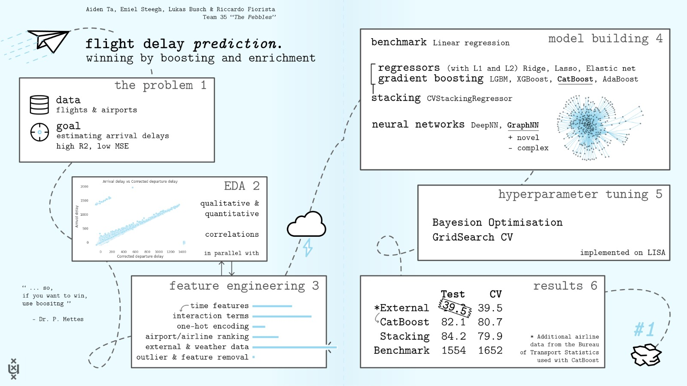

# Flight Delay Prediction Kaggle Challenge
In this repo we present our collected works towards the first place of the 2021 AML Kaggle Competition.

# A short summary
- [CatBoost](https://catboost.ai/) for the win; always
- Work on EDA and data sanitation first!
- The data makes the difference - use external one to enrich it
- Don't do Graph Neural Networks unless:
  - it's not a spatio-temporal problem on which you want to do edge-regression
  - there's actual research and tutorials on what you're doing
  - you have a PhD in geometric learning

With love from **Team Pebbles**

